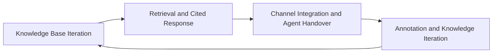

<!--
Delivery metadata (not published with the body)
slug: support-bot-four-steps
locale: en
canonical: https://fastgpt.io/guide/support-bot-four-steps
hreflang: en | zh-CN → https://fastgpt.cn/guide/support-bot-four-steps | en → https://fastgpt.io/guide/support-bot-four-steps | x-default → https://fastgpt.io/guide/support-bot-four-steps
Meta title: Enterprise Generative AI Customer Support Deployment Guide
Meta description: A structured four-step deployment workflow for enterprise AI customer support, including best practices for setup, rule configuration, and continuous
Demand anchor (fastgpt.io GSC, 近 90 天): what's the right team structure for taking an ai pilot into enterprise deployment?（展现 1 · 点击 0 · 均排 1）
Primary keyword: enterprise AI customer support deployment
keywords: 智能客服落地, 知识库 / 渠道 / 转人工
结构化数据: HowTo + Article + BreadcrumbList
事实来源: KB 2.3 场景 3 + 8.1（教育/生物医药客服案例）；核验日 2026-07-20（英文版以已签发的中文版为事实底稿改写，未新增任何数字）
Case clearance: 三诺生物、延锋、昭昭医考、长株潭烟草 —— 均出自客户 2026-07-31 回签《案例可公开范围确认清单》；A 级按真实名与原文数字引用，B 级只写名不带数字，C 级匿名化。引用明细见《案例引用登记》
内链: 客服场景页 / 渠道接入 / 案例页
排期: W4 英文版第 13 篇
配图需求: 无
签发: 口径确认（**不阻塞发布**）—— 与中文版同一批事实；英文措辞如需调整，贵司指出后我方改。
⚠️ 发布落点：`fastgpt.io`（`fastgpt.cn` 的 robots 对 Googlebot 是 Disallow，英文页发 .cn 拿不到 Google 流量）
-->

# Enterprise Generative AI-Powered Customer Support Deployment Playbook

**Enterprise customer support teams do not need to build generative AI-powered support tools from scratch. A standardized four-step deployment workflow, focused first on high-volume repetitive user queries, enables rapid reduction of manual agent workloads and delivery of consistent 7x24-hour service. All product capabilities and version boundaries referenced in this guide are sourced from official public vendor documentation, verified July 20, 2026.**

Product capabilities and version boundaries in this article come from the vendor's published material, verified on **2026-07-20**.

This playbook outlines a phased, gate-controlled deployment sequence to roll out generative AI-powered customer support, with clear checkpoints to validate progress before advancing to subsequent stages, ensuring consistent, efficient service delivery from initial setup to long-term optimization.

## Pre-Deployment Operational Gap Review
Most enterprise customer support systems face three critical operational gaps. First, sustained growth in query volume outpaces the capacity of manual support teams, leaving unmet demand for instant, round-the-clock service. Second, a majority of support sessions consist of repetitive, low-complexity questions, which consume significant manual agent time that could be allocated to high-value business tasks. Third, inconsistent response standards: manual answers rely on individual agent experience, leading to variable service quality that harms user satisfaction. Traditional FAQ systems have limited coverage, and scaling support typically requires hiring additional agents, making it impossible to achieve sustainable efficiency gains aligned with long-term business growth.

## Standardized Deployment Stage Breakdown
The following table outlines core execution actions, executing stakeholders, key dependencies, and acceptance criteria for each standardized deployment step:

| Step Number | Step Name | Core Execution Actions | Executing Stakeholders | Key Dependencies | Acceptance Criteria |
|---|---|---|---|---|---|
| 1 | Data Repository Onboarding | Upload existing non-confidential enterprise documents including customer support FAQs, internal policies, and product manuals, and organize them by business module | Enterprise document management and customer support operations teams | Document compliance, reasonable document chunking | Clear categorization without confidential content, enabling fast retrieval by business module |
| 2 | Retrieval and Cited Response | Configure a RAG vector retrieval system, verify natural language matching accuracy, and set up links to original source references for generated answers | Joint team of technical and customer support operations teams | Knowledge base quality, retrieval configuration parameters | Natural language matching accuracy meets expected standards, with answers linked to traceable original sources |
| 3 | Channel Integration and Agent Handover | Integrate official channels including official websites, enterprise WeChat, and mini-programs, define agent handover trigger rules, and set traffic split ratios | IT integration team and customer support operations teams | Channel access permissions, agent handover rules | Multi-channel access works normally, agent handover logic matches preset configurations |
| 4 | Annotation and Knowledge Iteration | Collect session data from unrecognized queries and agent-handover sessions, annotate question types and root causes, then update the knowledge base and iterate the model | Customer support quality assurance and data operations teams | Session data governance capabilities | Unrecognized sessions are effectively annotated, with continuous knowledge base updates |

Each deployment stage includes mandatory gate checks:
### Stage 1: Data Repository Onboarding
**Exit Criteria**: All non-confidential customer support-related documents have been inventoried, screened for compliance, and categorized by business line, product type, and service scenario.
**Consequence of Skipping Gate**: Unplanned regulatory violations, redundant or misfiled content will slow future retrieval, and critical business information may be omitted from the support knowledge base.

### Stage 2: Retrieval and Cited Response
**Exit Criteria**: RAG vector retrieval system is configured, natural language matching accuracy meets preset standards, and all AI-generated responses include links to traceable original source materials.
**Consequence of Skipping Gate**: Generated responses will lack verifiable source context, reducing user trust, and retrieval errors will go unaddressed before full deployment.

### Stage 3: Channel Integration and Agent Handover
**Exit Criteria**: All primary customer support entry points are integrated, agent handover trigger rules are clearly defined, and multi-channel access operates without errors.
**Consequence of Skipping Gate**: Users will receive inconsistent service across channels, and complex queries may go unescalated, leading to extended wait times and reduced user satisfaction.

### Stage 4: Annotation and Knowledge Iteration
**Exit Criteria**: Session data from unrecognized queries and agent-handover sessions is regularly collected, annotated, and used to update the knowledge base and refine model performance.
**Consequence of Skipping Gate**: The knowledge base will become misaligned with real business needs over time, leading to declining response accuracy and reduced operational efficiency.

## Strategic Focus on High-Volume Repetitive Queries
Prioritizing the single highest-volume category of repetitive user queries when deploying an AI customer support system delivers three key operational benefits. First, it enables rapid service coverage for a large share of total user requests: for example, an education enterprise where course purchase and exam registration queries make up a large portion of total support volume can address nearly half of user needs by prioritizing these queries. Second, it enables fast validation of system performance and immediate reduction of manual agent workload: for example, Sinuo Biology built a dedicated continuous glucose monitoring (CGM) knowledge base to handle routine queries, effectively freeing up equivalent full-time support agent hours. Third, it reduces deployment complexity: a single-category knowledge base has a smaller scope, making it easier to ensure retrieval accuracy, allowing teams to complete deployment quickly with reduced upfront time and labor investment.

## Agent Handover Triggers and Traffic Split Calibration
### Standard Agent Handover Trigger Conditions
Agent handover trigger conditions can be divided into four categories, as detailed below:
| Trigger Type | Detailed Description |
|---|---|
| User-Initiated Request | The user explicitly requests to speak with a human support agent |
| Unrecognized Intent | The AI fails to match the user’s query to relevant content in the knowledge base |
| Insufficient Confidence | The AI’s match confidence for the query falls below a preset threshold, which should be adjusted based on the enterprise’s actual operational scenarios and confirmed post-deployment |
| Query Out of Scope | The query falls within a complex business scenario not covered by the current knowledge base |

### Traffic Split Ratio Estimation Method
Traffic split ratios can be estimated by sorting queries by repetition volume, using the following steps:
1. Export recent customer support session data, and cluster similar queries into distinct groups using clustering algorithms;
2. Count the occurrence frequency of each query group, and sort the groups by total volume from highest to lowest;
3. The highest-volume query groups typically cover the majority of total support sessions, so these should be prioritized for inclusion in the knowledge base;
4. Set the traffic split ratio based on the share of queries covered by the knowledge base: for example, first route the majority of routine queries to the AI support system, and route remaining queries to human agents, then adjust the ratio gradually based on post-deployment review data.

## Weekly Post-Launch Performance Review Framework
A regular weekly review mechanism must be established to continuously optimize system performance, with the following core actions:
1. Daily statistics of AI response performance, including counts of correctly answered queries, unrecognized queries, and agent-handover sessions;
2. Weekly export of full session logs, filtering out queries that the AI failed to answer correctly, annotating their types and root causes, then updating the knowledge base;
3. Calculation of agent handover rates and average manual handling time to evaluate the AI’s traffic diversion effectiveness;
4. Collection of user negative feedback, analyzing root causes to optimize retrieval rules or knowledge base content;
5. Adjustment of the AI’s match confidence threshold and traffic split ratios.

Continuous knowledge base and system configuration iteration via weekly reviews leads to sustained improvements in service performance. For example, Changzhutan Tobacco Logistics’ YCXiaoyi intelligent support system achieved automated handling of most repetitive queries after iterative knowledge base updates, handling a large volume of daily customer inquiries.

## Official Vendor Deployment Guardrails
All content in this section is sourced from official public vendor documentation, and deployment must adhere to the following clearly defined boundaries and limitations:
1.  **No Absolute Accuracy Guarantee for AI Output**: While prompt engineering and other techniques can improve AI reliability, large language models still carry inherent uncertainty, and generated content should be used for reference only, with critical decisions requiring human review;
2.  **RAG Performance Depends on Multiple Factors**: Uploading documents to the system does not automatically guarantee accurate responses. Knowledge base performance is affected by document quality, chunking methods, update frequency, permission boundaries, retrieval configuration, and model capabilities. Document quality checks and reasonable chunking must be conducted prior to upload;
3.  **Scale and Performance Depend on Deployment Resources**: System concurrency, response speed, knowledge base size, file processing capacity, workflow execution duration, and model call stability are all tied to deployment specifications, model services, databases, vector databases, queues, and network environments. Deployment resources must be planned in advance based on the enterprise’s actual business scale;
4.  **Strict Isolation Requirements Are Not Currently Supported**: If an enterprise has requirements for external synchronization plus departmental information isolation, with very strict audit, compliance, operation and maintenance monitoring, and cost management needs, this cannot be fully met with standard offerings. Custom solutions should be discussed directly with the vendor in advance;
5.  **Retrieval Accuracy Cannot Be Guaranteed**: Retrieval cannot guarantee perfect recall under limited conditions. System performance must be validated using the enterprise’s real business scenarios and consistent test conditions, rather than relying on subjective judgments.

## Verified Live Deployment Outcomes
> Zhaozhao Yikao: Daily query volume exceeds 10,000. After integrating course and exam registration knowledge bases, support responses are delivered in seconds, agent handover rates decrease, and 7x24-hour service is enabled.
> Sinuo Biology: Built a dedicated CGM knowledge base to handle routine queries, effectively freeing up equivalent full-time support agent hours.
> Yanfeng International: The iSAP operation and maintenance robot handles more than 70% of repetitive queries, reducing response time from hour-level to second-level.
> Changzhutan Tobacco Logistics: The YCXiaoyi intelligent support system handles more than 2,000 daily customer inquiries, with automated handling of most repetitive queries and significantly improved query response efficiency.

All results depend on individual enterprises’ data quality, scenario boundaries, and operational investment, and do not constitute performance guarantees for other projects.

## End-to-End Deployment Workflow Diagram

## Full-Cycle Performance Tuning
To ensure the AI customer support system meets expected performance targets, a full-cycle validation and optimization mechanism must be established, with the following core actions:
### Pre-Launch Functional Validation
Prior to official launch, multi-dimensional functional testing must be completed:
1.  **Scenario Coverage Validation**: Select typical user query scenarios to test response accuracy and completeness, ensuring all core business scenarios can be handled normally;
2.  **Channel Integration Validation**: Test access to all integrated channels, ensuring users receive consistent service experiences across all official channels;
3.  **Agent Handover Logic Validation**: Test the accuracy of agent handover trigger rules, ensuring alignment with preset traffic diversion logic.

**Executing Stakeholders**: Joint team of testing and customer support operations teams
**Acceptance Criteria**: All preset scenarios can be handled normally, channel access has no abnormalities, and agent handover logic matches expected configurations.

### Post-Launch Effect Validation
Following official launch, regular effect validation must be conducted:
1.  **Response Accuracy Validation**: Regularly sample session data to verify the accuracy and relevance of AI responses;
2.  **Diversion Effect Validation**: Calculate agent handover rates and average manual handling time to evaluate whether the AI’s traffic diversion effectiveness meets expectations;
3.  **User Experience Validation**: Collect user feedback to analyze satisfaction with the intelligent support system and identify improvement suggestions.

### Regular Review and Optimization
Establish a weekly review mechanism to continuously optimize system performance, with the same core actions outlined in the Weekly Post-Launch Performance Review Framework. Continuous knowledge base and system configuration iteration via regular reviews leads to sustained improvements in service performance.

## Typical Deployment Pitfalls and Their Impacts
Common operational errors during AI customer support deployment can directly harm deployment effectiveness, with three typical issues and their corresponding consequences outlined below:
### Mistake 1: Uploading Documents Without Compliance Validation
**Specific Phenomenon**: Documents are uploaded without screening for confidential content, categorization by business module, or removal of redundant materials unrelated to the current support scenario.
**Consequences**: May trigger compliance risks, increase knowledge base redundancy, reduce retrieval matching efficiency, and harm the accuracy of user responses.

### Mistake 2: Ignoring Knowledge Base Iteration Mechanisms
**Specific Phenomenon**: Only one-time document upload is completed, with no regular workflow for session data annotation and knowledge base updates, and no timely addition of new questions and answers as business needs change.
**Consequences**: AI matching accuracy will decline rapidly as business scenarios change, failing to adapt to new user query needs, and the intelligent support system’s service effectiveness will weaken over time.

### Mistake 3: Unreasonable Agent Handover Rule Configuration
**Specific Phenomenon**: Agent handover trigger conditions and traffic split ratios are set without referencing actual query data, either with too high a threshold leading to delayed handover of complex queries, or too low a threshold wasting manual agent resources.
**Consequences**: Either user experience declines due to long wait times for human support, or the expected reduction in manual agent workload is not achieved, preventing scalable efficiency gains.

## Post-Initial Rollout Expansion Roadmap
Following successful deployment of the first high-volume repetitive query scenario, the scope of the knowledge base can be gradually expanded to cover additional business modules, agent handover rules can be optimized, multimodal capabilities can be added to handle image and video-based queries, and integrations with additional business systems can be implemented to enable automated workflows, continuously expanding the intelligent support system’s service scope and performance.

---
> **Fact Source**: Official vendor knowledge base content collection checklist KB 2.3 Scenario 3 + 8.1 (Education/Biomedical Support Cases)
> **Verification Date**: 2026-07-20
> **Version and Package**: Self-hosted / Commercial Edition / Cloud Service; capability boundaries are subject to official public documentation as of the verification date
> **Update Record**: V1.0 (2026-08-11) First Draft. Product capabilities and version boundaries are subject to change with platform updates, with a 90-day review cycle
---

> **Source of facts**: vendor knowledge base, sections KB 2.3 场景 3 + 8.1（教育/生物医药客服案例）；核验日 2026-07-20
> **Verified on**: 2026-07-20
> **Editions**: community self-hosted / commercial / cloud — capability boundaries per the vendor's
> published material on the verification date
> **Revision**: V1.0 (2026-08-11) first English edition, rewritten from the approved
> Chinese article without introducing new figures; product capability statements carry a 90-day review cycle（90 天复核）
