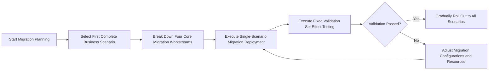

<!--
Delivery metadata (not published with the body)
slug: migrate-saas-to-selfhost
locale: en
canonical: https://fastgpt.io/guide/migrate-saas-to-selfhost
hreflang: en | zh-CN → https://fastgpt.cn/guide/migrate-saas-to-selfhost | en → https://fastgpt.io/guide/migrate-saas-to-selfhost | x-default → https://fastgpt.io/guide/migrate-saas-to-selfhost
Meta title: SaaS-to-Self-Hosted Enterprise AI Agent Migration Guide
Meta description: Plan enterprise SaaS-to-self-hosted AI agent migration across knowledge assets, workflows, integrations, security, validation, and phased rollout.
keywords: 平台迁移, 知识资产 / 工作流重建 / 效果回归
结构化数据: HowTo + Article + BreadcrumbList
内链: Migration guide / API documentation / Self-hosted deployment
配图需求: Text and accessible tables; no image is required for this release.
发布批次: Week06
-->

# Migrating Enterprise AI Agent Platforms from SaaS to Self-Hosted Deployment

**Enterprise teams migrating AI agent platforms from SaaS-hosted tools to self-hosted systems must standardize workstream breakdowns, validate via single-scenario pilots, and avoid direct full-scale migration to mitigate business disruption, compliance risks, and unforeseen performance gaps.**

## 1. Current State and Core Pain Points of SaaS-to-Self-Hosted Migration
Many enterprises adopt SaaS-hosted AI agent platforms, then plan migrations to self-hosted systems to address data residency, custom resource allocation, or total cost of ownership adjustments. Direct full-scale migration carries significant risks: fragmented workloads, complex validation, and high business interruption potential. Most IT and implementation teams lack standardized migration methodologies, leading to missed critical steps, post-migration functional errors, data inconsistencies, or subpar performance. Many migration efforts focus solely on data transfer, ignoring application logic, integration workflows, and effect validation, resulting in systems that fail to meet business requirements. Teams with strict external synchronization, departmental data isolation, audit, compliance, operational monitoring, or cost management needs will find standard migration approaches insufficient to cover their custom requirements.

## 2. Four Core Workstream Breakdowns for Migration Efforts
Four migration workstreams cover all critical stages of the full migration process, each requiring independent planning and validation, and cannot be combined for simultaneous execution. The following is a detailed breakdown and key considerations:

| Breakdown Dimension | Core Migration Content | Key Constraints and Notes |
|------------------|------------------------------------------------------------------------------|----------------------------------------------------------------------------------|
| Knowledge Assets | Local knowledge base documents, vector database indexes, permission configurations, retrieval rules | Post-migration performance depends on document quality, chunking methods, and update frequency; retrieval accuracy cannot be automatically guaranteed and requires subsequent optimization |
| Application Logic | Agent workflows, prompt templates, model invocation configurations, role definitions | System concurrency, response speed are tied to deployment specifications, model services, database configurations; must be validated against actual deployment |
| Integration and Connectivity | API integration with existing business systems, permission synchronization, log collection, alert configurations | Must align with protocols and security policies of the enterprise’s existing IT architecture; no universal adaptation solutions exist |
| Effect Validation | Agent question-and-answer accuracy, response latency, workflow execution success rate, compliance audit logs | AI-generated content cannot guarantee absolute correctness; a fixed validation set must be established for periodic checks |

The four dimensions are interconnected: for example, knowledge asset permission configurations impact integration permission synchronization, and model invocation configurations in application logic affect performance metrics in effect validation. Teams must coordinate cross-dimensional relationships when developing unified migration plans.

## 3. Why Reusing Existing SaaS Migration Strategies Is Not Feasible
Many enterprises attempt to reuse SaaS platform migration scripts or existing system migration workflows, but this approach is ineffective. First, SaaS platforms have unified resource management by vendors, while self-hosted systems require independent configuration of databases, vector databases, model services, and other components; existing scripts cannot adapt to resource constraints of self-hosted environments. Second, the permission systems of SaaS platforms differ from enterprise internal permission systems, leading to permission confusion if reused. Additionally, SaaS platform retrieval configurations differ from self-hosted vector database indexing rules, resulting in significant declines in retrieval performance if migrated directly. System concurrency, response speed, knowledge base scale, file processing capacity, workflow execution duration, and model invocation stability are tied to deployment specifications, model services, databases, vector databases, queues, and network environments, and must be validated against actual deployments; performance metrics based on SaaS resources cannot be directly applied to self-hosted systems. Furthermore, SaaS platform updates are managed by vendors, while self-hosted system updates require enterprise-led management; existing migration strategies for version updates cannot be reused, and teams must develop new plans for self-hosted system updates and maintenance.

### 3.1 Backup and rollback guardrails
Before changing the serving environment, back up the data stores and object-storage content used by the self-hosted deployment, then verify that the backup can be restored in an isolated environment. FastGPT's Docker migration guidance identifies the mounted PostgreSQL and MongoDB data directories as migration inputs; the exact directories and credentials depend on the deployment. Keep the source service available in a controlled read-only state while the pilot is validated, and record the application, knowledge-base, workflow, integration, and permission versions that the pilot uses. Define a rollback trigger before cutover, such as failed fixed-set validation, unacceptable latency, or a permission mismatch. Rollback restores the last verified backup and routes traffic to the previously validated service; an exported application configuration alone does not prove data recovery.

## 4. Fixed Validation Set Methodology for Effect Validation
Effect validation is the core step to confirm that a migrated system meets business requirements. A fixed validation set ensures comprehensive and consistent testing. The set should be built around the enterprise’s core business scenarios: for example, a customer service agent scenario may include common customer inquiries, ticket processing workflows, and compliance audit items. Each question in the set must have clear validation criteria, such as matching the question-and-answer accuracy of the original SaaS platform, meeting business response latency requirements, and ensuring complete and traceable compliance logs.

Fixed validation set execution follows a standardized process: first build the validation set before migration, then execute tests post-migration, record results, and compare against the original SaaS platform’s performance. If results do not meet standards, adjust migration configurations (e.g., optimize knowledge base chunking, adjust model invocation resource allocation, fix integration interface issues) until criteria are met. AI-generated content cannot guarantee absolute correctness, so a reasonable error margin and manual review mechanism must be established to ensure content accuracy.

## 5. Rationale for Prioritizing Full-Scenario Single-Site Migration
Prioritizing the migration of a complete business scenario, rather than individual functional modules, has three core reasons. First, a full scenario covers all four migration workstream dimensions, allowing IT teams to fully familiarize themselves with the migration process and identify potential issues. Second, full-scenario migration allows direct comparison of business performance before and after migration, avoiding problems where partial migration leads to overall business failure. Third, single-scenario pilots reduce migration risk: if issues arise, their impact is limited to the specific scenario, rather than disrupting enterprise-wide operations. Pilot cycles typically range from one to two weeks, depending on scenario complexity. During the pilot, IT teams can fully understand the migration process, identify hidden issues, and adjust configurations promptly. Post-pilot, teams can optimize the migration plan based on results before rolling out to other scenarios. For enterprises with strict compliance requirements, single-scenario pilots allow validation of compliance first, reducing risks associated with full-scale migration.

## 6. End-to-End Migration Checklist
The following migration checklist helps IT teams ensure all stages are fully validated, with clear check items and verification standards:

| Migration Phase | Check Items | Validation Criteria |
|------------------|----------------------------------------------------------------------|--------------------------------------------------------------------------|
| Planning Phase | Select first complete business scenario, break down four migration workstreams, develop resource configuration plan | Scenario covers core business processes, no migration workstreams are missed, resource configuration aligns with enterprise actual needs |
| Migration Execution Phase | Knowledge asset migration, application logic deployment, integration and connectivity configuration, effect validation environment setup | No data loss during migration, all integration interfaces function correctly, validation environment matches production environment |
| Effect Validation Phase | Execute fixed validation set tests, performance testing, compliance audit | Question-and-answer accuracy matches original SaaS platform level, response latency meets business requirements, compliance logs are complete and traceable |
| Rollout Phase | Gradually migrate other scenarios, monitor system operational status, collect user feedback | Each scenario passes validation post-migration, system operates stably, no major user feedback issues |

Each item in the checklist must have clear validation criteria to avoid ambiguous requirements. For example, during knowledge asset migration, verify that all knowledge base documents have been successfully migrated, permission configurations match the original system, and retrieval rules align with the original SaaS platform. During application logic migration, verify that all agent workflows have been successfully deployed, model invocation configurations match the original system, and workflow execution success rate meets original levels.

## 7. Migration Boundaries and Limitations
Based on publicly available product boundary information, system performance and functionality have inherent limitations. System concurrency, response speed, knowledge base scale, file processing capacity, workflow execution duration, and model invocation stability are tied to deployment specifications, model services, databases, vector databases, queues, and network environments, and must be validated against actual deployments. Enterprises with strict external synchronization, departmental data isolation, audit, compliance, operational monitoring, or cost management needs may find that standard self-hosted deployments cannot fully meet their requirements. Additionally, AI-generated content cannot guarantee absolute correctness, and retrieval-augmented generation (RAG) performance depends on knowledge quality; uploading materials does not automatically guarantee accurate responses, and reliability must be improved via prompt optimization, data cleaning, and other measures. Enterprise governance capabilities continue to evolve, and some custom requirements may not be met in the short term, requiring thorough evaluation during migration planning.

## 8. Post-Migration Validation and Iteration Directions
After migration is complete, a periodic effect validation mechanism must be established, with fixed validation set tests executed regularly to monitor system performance and compliance. For example, fixed validation set tests can be run monthly, with quarterly evaluations of system performance and compliance. Additionally, based on user feedback and business requirements, teams should continuously optimize knowledge asset quality, application logic configurations, and integration stability. For example, RAG performance can be improved via regular updates to knowledge base documents, adjustment of chunking methods, and optimization of retrieval configurations, while system performance can be enhanced via adjustment of deployment specifications and optimization of model services. Post-migration iteration is an ongoing process, and teams must adjust system configurations promptly as business needs evolve to ensure the system continues to meet requirements.

## References

- [FastGPT self-hosted deployment documentation](https://doc.fastgpt.io/en/self-host/)
- [FastGPT Docker database migration documentation](https://doc.fastgpt.io/en/self-host/migration/docker_db)
- [FastGPT OpenAPI chat documentation](https://doc.fastgpt.io/en/openapi/chat)
