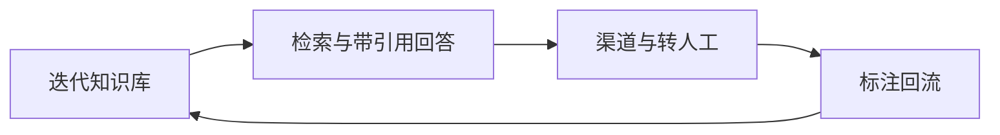

<!--
交付元数据（不随正文发布）
slug: support-bot-four-steps
canonical: https://fastgpt.cn/guide/support-bot-four-steps
hreflang: zh-CN | zh-CN → https://fastgpt.cn/guide/support-bot-four-steps | en → https://fastgpt.io/guide/support-bot-four-steps | x-default → https://fastgpt.io/guide/support-bot-four-steps
Meta title: 智能客服落地全指南：流程拆解、边界限制与效果优化
Meta description: 介绍智能客服落地四步标准流程、边界、验证方法及常见误区，含高重复咨询场景落地要点，帮助企业搭建高效系统，释放客服人力，优化服务体验，适配企业规模化服务需求。
keywords: 智能客服落地, 知识库 / 渠道 / 转人工
结构化数据: HowTo + Article + BreadcrumbList
对应元语义题: 19
需求依据: 智能客服机器人 22,072（同族，见 #4）
事实来源: KB 2.3 场景 3 + 8.1（教育/生物医药客服案例）；核验日 2026-07-20
案例引用: 三诺生物、延锋、昭昭医考、长株潭烟草 —— 均出自客户 2026-07-31 回签《案例可公开范围确认清单》；A 级按真实名与原文数字引用，B 级只写名不带数字，C 级匿名化。引用明细见《案例引用登记》
内链: 客服场景页 / 渠道接入 / 案例页
排期: W4 第 3 篇
配图需求: 无
签发: 口径确认（**不阻塞发布**）—— 内容依据客户 KB 撰写，发布前请客户核对：①版本与能力边界 ②商业口径 ③点名与措辞。**如有不符，客户可直接不上该页或指出后我方改**，不需要走签署流程。
-->

# 智能客服落地全指南：从流程拆解到效果优化
**企业搭建智能客服无需从零开发，按资料入库、检索回答、渠道转人工、标注回流四步流程落地，优先覆盖高重复咨询场景，可快速释放客服人力，实现7×24小时标准化服务。**

## 1. 企业智能客服落地的核心现状与痛点
当前企业客服体系普遍面临三类核心问题。第一类是咨询量持续攀升，人工客服无法覆盖全时段服务，难以满足用户即时响应的需求。第二类是重复问题占比高，据统计，多数企业的客服会话中，超半数为重复咨询，这类问题占用大量客服人力，挤占高价值业务处理时间。第三类是口径不统一，人工回答依赖个人经验，易出现标准不一致的情况，影响用户服务体验。传统FAQ覆盖范围有限，业务增长往往只能依靠增加客服人员，难以实现规模化提效，无法适配企业长期发展的服务需求。

## 2. 智能客服落地四步标准流程
智能客服落地可按标准化四步流程推进，核心执行动作、执行主体、关键依赖及验收标准如下表所示：
| 步骤序号 | 步骤名称 | 核心执行动作 | 执行主体 | 关键依赖 | 验收标准 |
| --- | --- | --- | --- | --- | --- |
| 1 | 资料入库 | 上传企业现有客服FAQ、制度文档、产品手册等非涉密资料，按业务模块分类整理 | 企业内部负责文档管理与客服运营的团队 | 资料合规性、文档切分合理性 | 分类清晰无涉密内容，可按业务模块快速检索 |
| 2 | 检索与带引用回答 | 配置RAG向量检索系统，验证自然语言匹配准确率，设置答案关联原文引用链接 | 技术团队与客服运营团队联合 | 知识库质量、检索配置参数 | 自然语言匹配准确率符合预期，答案关联原文可追溯 |
| 3 | 渠道与转人工 | 对接官网、企微、小程序等官方渠道，定义转人工触发规则，设置分流比例 | IT对接团队与客服运营团队 | 渠道对接权限、转人工规则 | 多渠道接入正常，转人工触发逻辑符合预设 |
| 4 | 标注回流 | 收集未命中、转人工的会话数据，标注问题类型与原因后补充至知识库，迭代模型 | 客服质检团队与数据运营团队 | 会话数据治理能力 | 未命中会话得到有效标注，知识库持续更新 |

每一步的核心细节如下：
- 资料入库阶段：需提前梳理企业现有客服相关的所有非涉密文档，避免遗漏重要业务资料，同时严格排查涉密内容，确保上传资料符合企业合规要求，可按业务线、产品类型、服务场景等维度分类，便于后续检索匹配时快速定位相关内容。
- 检索与带引用回答阶段：需遵循RAG场景的通用规则，即AI输出需关联原文来源，便于用户验证信息真实性，同时需注意，检索效果受文档质量、切分方式等因素影响，无法保证百分之百准确召回。
- 渠道与转人工阶段：需覆盖企业主要的客服入口，确保用户可以在任意渠道获得一致的服务体验，同时需提前定义清晰的转人工触发条件，避免出现用户等待无响应的情况。
- 标注回流阶段：需建立常态化的数据迭代机制，将真实会话数据转化为知识库增量，持续优化系统效果，避免知识库内容与实际业务需求脱节。

## 3. 优先覆盖单类高重复咨询的理由
企业落地智能客服时，优先选择咨询量最大的单类重复问题，主要有三点原因。第一，高重复问题的覆盖范围广，可快速实现服务覆盖，比如某教育企业的购课、报考类咨询占总咨询量的较大比例，优先覆盖这类问题可直接解决近半数的用户需求。第二，见效快，可快速验证系统效果，释放客服人力，比如三诺生物通过搭建CGM专属知识库，拦截常规咨询，等效节省全职客服人力。第三，降低落地复杂度，单类问题的知识库规模更小，检索准确率更容易保障，便于团队快速上手落地，减少前期投入的时间与人力成本。

## 4. 转人工规则与分流比例估算方法
### 4.1 转人工条件的标准写法
转人工触发条件可分为四类，具体规则如下表所示：
| 触发类型 | 具体说明 |
| --- | --- |
| 用户主动请求 | 用户明确提出转接人工客服的需求 |
| 意图无法识别 | AI无法匹配到知识库中的相关内容 |
| 置信度不足 | AI对问题的匹配置信度低于预设阈值，阈值需按企业实际场景调整，需按实际部署确认 |
| 问题超出范围 | 问题属于知识库未覆盖的复杂业务场景 |

### 4.2 分流比例的估算方法
分流比例可按重复度排序进行估算，具体步骤如下：
1. 导出近段时间的客服会话数据，通过聚类算法将相似问题归为一类；
2. 统计每类问题的出现次数，按次数从高到低排序；
3. 占比最高的部分问题类别通常覆盖多数总咨询量，优先将这些问题纳入知识库；
4. 分流比例可按覆盖的咨询量占比设置，比如先让AI处理多数常规咨询，剩余部分转人工，后续根据复盘数据逐步调整比例。

## 5. 上线后的每周复盘动作
上线后需建立每周复盘机制，持续优化系统效果，具体动作包括：
1. 每日统计AI应答的命中情况，包括正确应答、未命中、转人工的会话数量；
2. 每周导出完整的会话日志，筛选出AI未正确回答的问题，标注问题类型、原因，补充到知识库；
3. 统计转人工率、人工平均处理时长，评估AI的分流效果；
4. 收集用户的差评反馈，分析差评原因，优化检索规则或知识库内容；
5. 调整转人工的置信度阈值，优化分流比例。

通过每周复盘，可快速迭代知识库与系统配置，持续提升服务效果。比如长株潭烟草物流的YC小易智能客服，通过持续迭代知识库，实现了多数重复问题自动处理，日均承接大量客户咨询。

## 6. 产品落地的边界与限制
智能客服系统的落地需遵循以下公开技术文档明确的边界与限制，所有内容均来自官方公开资料：
1.  **AI输出不承诺绝对正确**：系统可通过提示词等方式提升AI应用的可靠性，但大模型本身仍存在不确定性，生成的内容仅供参考，关键决策需人工复核；
2.  **RAG效果依赖多维度因素**：系统不能自动保证上传资料后就一定答得准，知识库效果会受到文档质量、切分方式、更新频率、权限边界、检索配置、模型能力等因素影响，需提前对上传文档进行质量校验与合理切分；
3.  **规模与性能依赖部署资源**：系统的并发、响应速度、知识库规模、文件处理能力、工作流执行时长、模型调用稳定性，都和部署规格、模型服务、数据库、向量库、队列、网络环境有关，需根据企业实际业务规模提前规划部署资源；
4.  **严格隔离需求暂无法满足**：若客户有外部同步+部门信息隔离需求，有非常严格的审计、合规、运维监控、成本管理要求，当前暂无法满足，需提前与厂商沟通定制化方案；
5.  **检索准确性需验证**：检索在有限条件下无法保证百分之百准确召回，需用企业真实业务场景和统一测试条件验证效果，避免主观判断系统性能。

## 7. 真实落地案例参考
> 昭昭医考：日均咨询量超1万，整合课程、报考知识库后，咨询秒级响应，人工转接率下降，实现7×24小时服务
> 三诺生物：搭建CGM专属知识库，拦截常规咨询，等效节省全职客服
> 延锋国际：iSAP运维机器人处理70%以上重复咨询，问题响应从小时级变为秒级
> 长株潭烟草物流：YC小易智能客服日均承接2000+客户咨询，多数重复问题自动处理，咨询响应效率大幅提升
上述结果依赖各自企业的资料质量、场景边界与运营投入，不构成对其他项目效果的承诺。

## 8. 落地架构流程图

## 9. 落地效果验证与持续优化
为确保智能客服系统达到预期效果，需建立全流程的验证与优化机制，具体动作包括：
### 9.1 上线前功能验证
在正式上线前，需完成多维度的功能测试：
1.  **场景覆盖验证**：选取典型的用户咨询场景，测试系统的应答准确性与完整性，确保核心业务场景均可正常响应；
2.  **渠道对接验证**：测试所有对接渠道的接入情况，确保用户可在任意官方渠道获得一致的服务体验；
3.  **转人工逻辑验证**：测试转人工触发规则的准确性，确保符合预设的分流逻辑。
**执行主体**：测试团队与客服运营团队联合
**验收标准**：所有预设场景均可正常应答，渠道接入无异常，转人工逻辑符合预期。

### 9.2 上线后效果验证
正式上线后，需定期开展效果验证：
1.  **应答准确率验证**：定期抽取部分会话数据，验证AI应答的准确性与相关性；
2.  **分流效果验证**：统计转人工率与人工处理时长，评估AI的分流效果是否符合预期；
3.  **用户体验验证**：收集用户反馈，分析用户对智能客服的满意度与改进建议。

### 9.3 常态化复盘优化
建立每周复盘机制，持续优化系统效果，具体动作包括：
1.  每日统计AI应答的命中情况，包括正确应答、未命中、转人工的会话数量；
2.  每周导出完整的会话日志，筛选出AI未正确回答的问题，标注问题类型、原因，补充到知识库；
3.  统计转人工率、人工平均处理时长，评估AI的分流效果；
4.  收集用户的差评反馈，分析差评原因，优化检索规则或知识库内容；
5.  调整转人工的置信度阈值，优化分流比例。
通过常态化复盘，可快速迭代知识库与系统配置，持续提升服务效果。

## 10. 常见做错的三种方式
在智能客服落地过程中，常见的错误操作会直接影响落地效果，以下为三类典型问题及对应后果：
### 方式一：未做合规校验直接上传资料
**具体现象**：未排查文档涉密性、未按业务模块分类就直接上传至系统，或上传了与当前客服场景无关的冗余资料。
**后果**：可能引发合规风险，同时增加知识库冗余度，降低检索匹配效率，影响用户应答准确性。
### 方式二：忽略知识库迭代机制
**具体现象**：仅完成一次性资料入库，未建立常态化的会话数据标注与知识库更新流程，随业务变化未及时补充新的问题与答案。
**后果**：系统匹配准确率随业务场景变化快速下降，无法适配新的用户咨询需求，智能客服的服务效果逐渐弱化。
### 方式三：转人工规则设置不合理
**具体现象**：未结合实际咨询数据设置转人工触发条件与分流比例，要么转人工阈值设置过高导致大量复杂问题无法及时转接，要么阈值过低浪费客服人力。
**后果**：要么用户体验下降，等待人工响应的时间过长，要么客服人力释放效果未达预期，无法实现规模化提效。

## 11. 下一步落地规划
完成第一类高重复场景的落地后，可逐步扩展知识库覆盖更多业务模块，优化转人工规则，接入多模态能力以处理图片、视频等类型的咨询，对接更多业务系统实现流程自动化，持续提升智能客服的服务范围与效果。
