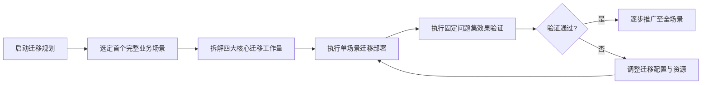

<!--
Delivery metadata (not published with the body)
slug: migrate-saas-to-selfhost
locale: zh
canonical: https://fastgpt.cn/guide/migrate-saas-to-selfhost
hreflang: zh-CN | zh-CN → https://fastgpt.cn/guide/migrate-saas-to-selfhost | en → https://fastgpt.io/guide/migrate-saas-to-selfhost | x-default → https://fastgpt.io/guide/migrate-saas-to-selfhost
Meta title: 从SaaS智能体平台迁移至自建的落地指南
Meta description: 拆解SaaS智能体平台迁移至自建的四大核心工作量，介绍单场景试点适配性验证方法，助力企业科学规划并推进迁移相关工作，规避迁移风险，覆盖迁移全流程核心环节。
keywords: 平台迁移, 知识资产 / 工作流重建 / 效果回归
结构化数据: HowTo + Article + BreadcrumbList
内链: 迁移指南 / API 文档 / 私有化页
配图需求: Text and accessible tables; no image is required for this release.
发布批次: Week06
-->

# 从SaaS智能体平台迁移至自建：分四块拆解与单场景试点策略

**企业从SaaS智能体平台迁移至自建系统，需先拆解知识资产、应用逻辑、集成对接、效果回归四大核心工作量，规避直接全量迁移的风险，通过单场景试点验证迁移效果与适配性，再逐步推进全量迁移。**

## 1. 企业迁移SaaS智能体平台的核心现状与痛点
很多企业在使用SaaS形态的智能体平台后，因数据合规、资源定制、成本结构调整等需求，计划迁移至自建系统。但直接全量迁移会面临工作量分散、验证难度大、业务中断风险高等问题。当前多数IT与实施团队缺乏标准化的迁移拆解方法，容易遗漏核心迁移环节，导致迁移后出现功能异常、数据不一致、性能不达标等问题。部分企业在尝试迁移时，仅关注数据的迁移，忽略了应用逻辑、集成对接与效果验证的环节，最终导致迁移后的系统无法满足业务需求。如果企业有外部同步+部门信息隔离需求，有非常严格的审计、合规、运维监控、成本管理要求，现有迁移思路无法完全覆盖这些定制化需求。

## 2. 迁移工作量的四大核心拆解维度
四大迁移工作量覆盖了迁移全流程的核心环节，每个维度的迁移都需要独立规划与验证，不能合并推进。以下是具体的拆解内容与注意事项：

| 拆解维度         | 核心迁移内容                                                                 | 关键约束与注意事项                                                                 |
|------------------|------------------------------------------------------------------------------|----------------------------------------------------------------------------------|
| 知识资产         | 本地知识库文档、向量库索引、权限配置、检索规则                                 | 迁移后效果受文档质量、切分方式、更新频率影响，无法自动保证检索准确率，需后续优化 |
| 应用逻辑         | 智能体工作流、提示词模板、模型调用配置、角色定义                             | 系统并发、响应速度与部署规格、模型服务、数据库配置直接相关，需按实际部署确认       |
| 集成对接         | 与现有业务系统的API对接、权限同步、日志采集、告警配置                         | 需适配企业现有IT架构的协议与安全策略，无通用适配方案                             |
| 效果回归         | 智能体问答准确率、响应时长、工作流执行成功率、合规审计日志                   | AI生成内容无法承诺绝对正确，需建立固定验证集进行周期性检查                       |

四大维度的拆解相互关联。比如知识资产的权限配置会影响集成对接的权限同步，应用逻辑的模型调用配置会影响效果回归的性能指标。因此，在拆解过程中，需要统筹考虑各个维度之间的关联，制定统一的迁移计划。

## 3. 直接复用原有迁移策略的不可行性分析
很多企业会直接复用SaaS平台的迁移脚本或原有系统的迁移流程，但这种做法不可行。首先，SaaS平台的资源由服务商统一管理，自建系统需要自主配置数据库、向量库、模型服务等组件，原有脚本无法适配自建环境的资源限制。其次，SaaS平台的权限体系与自建系统的企业内部权限体系存在差异，直接复用会导致权限配置混乱。另外，SaaS平台的检索配置与自建系统的向量库索引规则不同，直接迁移会导致检索效果大幅下降。系统的并发、响应速度、知识库规模、文件处理能力、工作流执行时长、模型调用稳定性，都和部署规格、模型服务、数据库、向量库、队列、网络环境有关，需按实际部署确认，原有基于SaaS资源的性能指标无法直接套用至自建系统。此外，SaaS平台的更新迭代由服务商统一负责，而自建系统的更新迭代需要企业自主负责，原有迁移策略中关于版本更新的规划也无法直接复用，企业需要重新规划自建系统的更新与维护流程。

### 3.1 迁移前备份与回滚护栏
切换服务环境前，先备份自建部署使用的数据存储和对象存储内容，并在隔离环境验证备份可以恢复。FastGPT 的 Docker 数据库迁移文档将挂载的 PostgreSQL 与 MongoDB 数据目录列为迁移输入，具体目录和凭据取决于实际部署。试点验证期间保留受控的只读源服务，并记录试点使用的应用、知识库、工作流、集成和权限版本。切换前明确回滚触发条件，例如固定问题集验证失败、延迟超出业务要求或权限不一致。回滚时恢复最后一次验证通过的备份，并将流量切回此前验证通过的服务；仅导出应用配置无法证明数据已经可恢复。

## 4. 效果回归的固定问题集验证方法
效果回归是迁移后验证系统是否满足业务需求的核心环节，固定问题集的方法可以确保验证的全面性与一致性。固定问题集的构建需要结合企业的核心业务场景，比如对于客服智能体场景，问题集可以包含常见的客户咨询问题、工单处理流程、合规审计项等。每个问题都需要对应具体的验证标准，比如问答准确率需达到原有SaaS平台的水平，响应时长需符合业务要求，合规日志需完整可追溯。

固定问题集的执行需要按照统一的流程进行，首先在迁移前构建问题集，然后在迁移后执行测试，记录测试结果，对比原有SaaS平台的表现。如果测试结果未达到标准，需要调整迁移配置，比如优化知识资产的切分方式、调整模型调用的资源配置、修复集成对接的接口问题等，直到测试结果符合要求。AI生成内容无法承诺绝对正确，因此在验证过程中，需要允许一定的误差范围，并建立人工审核机制，确保生成内容的准确性。

## 5. 优先迁移完整场景的核心理由
优先迁移一个完整的业务场景，不用分散迁移单个功能模块，有三个核心原因。第一，完整场景的迁移可以覆盖四大迁移工作量的所有环节，帮助IT团队全面熟悉迁移流程，发现潜在的问题。第二，完整场景的效果验证可以直观对比迁移前后的业务效果，避免出现局部迁移后整体业务无法正常运行的问题。第三，单场景试点可以降低迁移的风险，即使出现问题，影响范围仅限于该场景，不会波及全企业的业务。单场景试点的周期通常为1-2周，具体时长取决于场景的复杂度。在试点过程中，IT团队可以全面熟悉迁移流程，发现潜在的问题，并及时调整迁移配置。试点完成后，企业可以根据试点结果，优化迁移计划，再逐步推广至其他场景。如果企业有严格的合规要求，单场景试点可以先验证该场景的合规性，再逐步推广至其他场景，避免全量迁移后出现合规风险。

## 6. 迁移全流程检查清单
迁移全流程的检查清单可以帮助IT团队确保每个环节都得到充分的验证，以下是具体的检查项与验证标准：

| 迁移阶段         | 检查项                                                                 | 验证标准                                                                 |
|------------------|----------------------------------------------------------------------|--------------------------------------------------------------------------|
| 规划阶段         | 选定首个完整业务场景、拆解四大迁移工作量、制定资源配置方案             | 场景覆盖核心业务流程，工作量拆解无遗漏，资源配置符合企业实际需求           |
| 迁移执行阶段     | 知识资产迁移、应用逻辑部署、集成对接配置、效果验证环境搭建             | 所有迁移内容无数据丢失，对接接口可正常调用，验证环境与生产环境一致         |
| 效果验证阶段     | 执行固定问题集测试、性能测试、合规审计                               | 问答准确率达到原有SaaS平台水平，响应时长符合业务要求，合规日志完整可追溯 |
| 推广阶段         | 逐步迁移其他场景、监控系统运行状态、收集用户反馈                       | 每个场景迁移后验证通过，系统运行稳定，用户反馈无重大问题                   |

检查清单中的每个项都需要有明确的验证标准，避免出现模糊的验证要求。比如在知识资产迁移的检查项中，需要验证所有的知识库文档都已成功迁移，权限配置与原有系统一致，检索规则与原有SaaS平台一致。在应用逻辑迁移的检查项中，需要验证所有的智能体工作流都已成功部署，模型调用配置与原有系统一致，工作流执行成功率达到原有水平。

## 7. 迁移的边界与限制条件
根据公开的产品边界信息，系统的性能与功能存在一定的限制。系统的并发、响应速度、知识库规模、文件处理能力、工作流执行时长、模型调用稳定性，都和部署规格、模型服务、数据库、向量库、队列、网络环境有关，需按实际部署确认。如果企业有外部同步+部门信息隔离需求，有非常严格的审计、合规、运维监控、成本管理要求，当前自建部署无法完全满足。此外，AI生成内容无法承诺绝对正确，RAG效果依赖知识质量，无法自动保证上传资料后就一定答得准，需通过提示词优化、数据清洗等方式提升可靠性。企业治理能力仍在持续完善，部分定制化需求可能无法在短期内得到满足，需要在迁移规划阶段进行充分的评估。

## 8. 迁移后的落地验证与迭代方向
迁移完成后，需要建立周期性的效果验证机制，定期执行固定问题集进行测试，监控系统的性能与合规性。比如可以每月执行一次固定问题集测试，每季度评估一次系统的性能与合规性。同时，根据用户反馈与业务需求，持续优化知识资产的质量、应用逻辑的配置、集成对接的稳定性。比如，可以通过定期更新知识库文档、调整切分方式、优化检索配置等方式提升RAG效果，通过调整部署规格、优化模型服务等方式提升系统性能。迁移后的迭代优化是一个持续的过程，企业需要根据业务的发展变化，及时调整系统的配置，确保系统始终满足业务需求。

## References

- [FastGPT self-hosted deployment documentation](https://doc.fastgpt.io/en/self-host/)
- [FastGPT Docker 数据库迁移文档](https://doc.fastgpt.io/en/self-host/migration/docker_db)
- [FastGPT OpenAPI 对话文档](https://doc.fastgpt.io/en/openapi/chat)
