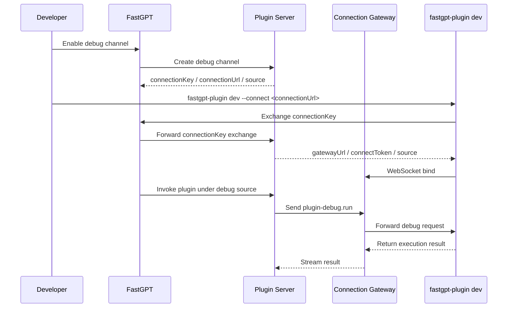

# FastGPT Remote Debug Suite Component Reference

This technical reference details the official remote debug suite components and workflow for self-hosted FastGPT deployments, enabling developers to locally test plugin integrations without replicating the full production environment.

## Component Reference
The remote debug suite relies on five core standardized components, each with a defined, non-interchangeable role:

| Component            | Purpose                                                                                 |
| -------------------- | --------------------------------------------------------------------------------------- |
| FastGPT main service | Provides the UI and APIs for enabling, refreshing, and revoking a debug channel.        |
| Plugin Server        | Manages `connectionKey`, debug source, and forwards debug invocations to Gateway.       |
| Connection Gateway   | Maintains CLI WebSocket connections, sessions, mailboxes, and debug invocation streams. |
| Redis                | Stores Gateway sessions, source owner leases, and mailbox data.                         |
| `fastgpt-plugin dev` | Runs plugins locally and connects to Gateway through WebSocket.                         |

## Standard Debug Workflow
The end-to-end debug flow is captured in the following official sequence diagram, which maps all cross-component interactions:

## Required CLI Command
The only mandatory command for initiating a local plugin debug session is `fastgpt-plugin dev --connect <connectionUrl>`, where `<connectionUrl>` is the value retrieved from the FastGPT main service after enabling a debug channel. This command automatically handles exchange of the connectionKey with the FastGPT API, retrieves required gateway credentials, and establishes a persistent WebSocket connection to the Connection Gateway. All plugin invocations routed through the Plugin Server will be forwarded to the local CLI instance for execution, with results streamed back to the core FastGPT environment.

> Source: [FastGPT official source](https://doc.fastgpt.cn/en/self-host/config/remote-debug-suite)

## Applicability and version scope

Use this page for the documented Deployment and upgrades scenario. Confirm the FastGPT, dependency, API, and deployment versions in the official source before applying a change.

## Safety guardrails

Use [REDACTED_CREDENTIAL] for credentials and private data. Confirm the documented environment and version before review.

## Rollback guidance

Restore the prior technical-content authority snapshot. Restore saved configuration and data snapshots, then repeat the smallest verification scenario.
